# AutoBleem 2 Benutzerhandbuch

AutoBleem 2 ist ein Spielstarter für die **PlayStation Classic** - und seit Version 2 für einen **Raspberry Pi**,
einen **PC mit USB-Stick-Boot** und **Windows**. Es zeigt Ihre PS1-Spiele als ein Regal von Covern mit ihren
Schachteln und Details, startet sie im gebündelten PCSX-Emulator und kann mit RetroArch daneben installiert
auch Spiele anderer Systeme spielen. Dieses Handbuch behandelt die Installation auf jeder Plattform, die
tägliche Verwendung und die mitgelieferten Tools.

> Die Downloads für jede Plattform finden Sie unter **https://autobleem.retromenele.pl/**. Die Seite ist
> nach Plattform organisiert: Das *Install*-Fenster jeder ist das, was Sie herunterladen; die *Build inputs*
> darunter sind, was die Installer selbst abrufen.

## 1. Was Sie bekommen

- **Der Launcher** - das Regal von Covern, die Sets (PlayStation, RetroArch, Apps), die Spieldetails, das
  Systemmenü, die Optionen, die Memory-Card- und Save-State-Tools. Das gleiche Programm auf jeder Plattform.
- **Zwei PS1-Emulatoren** - `pcsx-abnxt`, der aktuelle (Standard), und `pcsx-ab`, der klassische Emulator,
  den AutoBleem schon immer mitgeliefert hat. Sie wählen einen in den Optionen; beide verwenden die gleichen
  Einstellungen und Memory Cards.
- **RetroArch** (optional auf jeder Plattform) für die anderen Systeme: NES, SNES, Mega Drive, Game Boy, Arcade
  und viele mehr. AutoBleem erstellt seine RetroArch-Listen aus den ROMs, die Sie kopieren, und startet
  jedes Spiel mit dem richtigen Core.
- **Die Console Tools** (nur PlayStation Classic): *PSC-Bios* für WiFi, Uhr und Gamepad-Zuordnung, und
  *ABFlashKit* zur Installation des AutoBleem-Kernels.
- **UpdateRoms** für Windows: Aktualisiert die RetroArch-Listen und Schachtelmuster eines Console-Sticks
  auf einem PC, da die Console selbst kein Netzwerk hat.

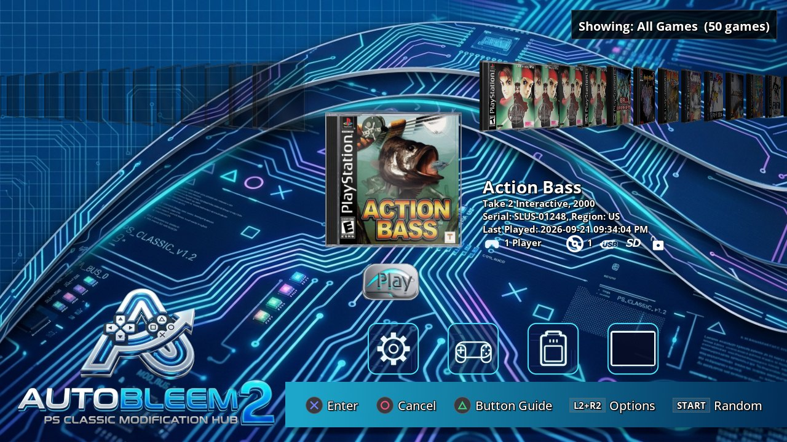

<!-- pagebreak -->

## 2. Installation

### 2.1 PlayStation Classic

Sie benötigen einen Windows-PC, einen USB-Stick (USB 2.0, 8 GB oder mehr; der Installer formatiert ihn auf
Anfrage) und die Standard-Console. AutoBleem läuft vom Stick ohne Änderungen an der Console. Der Stick
muss **FAT32** sein für eine Standard-Console - ihr Kernel kann exFAT nicht lesen. Nur eine Console mit
installiertem AutoBleem-Kernel (ABFlashKit, Kapitel 6) bootet auch von einem exFAT-Stick, was die 4-GB-Grenze
von FAT32 hebt.

1. Laden Sie **AutoBleemInstaller-<version>.zip** vom PlayStation Classic-Bereich der Website herunter und
   entpacken Sie es überall. Es enthält `AutoBleemInstaller.exe` und das AutoBleem-Paket, das es installiert.
2. Verbinden Sie den Stick und starten Sie `AutoBleemInstaller.exe`. Wählen Sie das Laufwerk oben aus.
   Wählen Sie aus, was Sie möchten:
   - **Stick formatieren** - nur für einen neuen Stick (alles darauf wird gelöscht). Wählen Sie FAT32, es sei
     denn die Console hat den AutoBleem-Kernel.
   - **Cover-Datenbanken** - die Schachtelmuster und Details der PS1-Bibliothek (standardmäßig angekreuzt;
     etwa 300 MB).
   - **RetroArch** - RetroArch mit seinen Cores, den zusätzlichen Anwendungen (Doom, Quake, Amiga, ...) und
     den Libretro-Assets für die Spiele anderer Systeme. Standardmäßig deaktiviert; kann später durch
     Ausführen des Installers erneut hinzugefügt werden.
   - **BIOS-Dateien** - die BIOS-Dateien, die die RetroArch-Cores benötigen (benötigt RetroArch).
   - **Beispielspiele** - ein paar kostenlose Homebrew-Spiele, damit das Regal nicht leer ist.
3. Drücken Sie **Installieren** und warten Sie. Die Fortschrittsbalken und das Protokoll zeigen jeden Schritt;
   der Stick wird am Ende `SONY` genannt und `UpdateRoms` wird darauf installiert (siehe Kapitel 5).
4. Nehmen Sie den Stick sicher heraus, verbinden Sie ihn mit dem **zweiten USB-Port** der Console (der rechte,
   Spieler 2) und schalten Sie die Console ein. AutoBleem startet statt des Stock-Menüs.

**Einschalten und Ausschalten.** Mit dem Stick drin bootet die Console, blinkt ein paar Sekunden lang (AutoBleem
wird aufgegriffen) und geht dann in den Standby-Modus, bevor etwas angezeigt wird - das ist die eigene Art der
Console, ein Update zu inszenieren, auf diese Weise läuft AutoBleem. Drücken Sie **Power** einmal und der
Launcher kommt herauf. *Power Off* im Systemmenü oder die Power-Taste der Console versetzt die Console in
**AutoBleem's Standby**: Der Stick wird getrennt, dann leuchtet das Licht **rot** - das Zeichen, dass AutoBleem
so funktioniert, wie beabsichtigt - und der nächste Power-Druck bringt den Launcher direkt zurück, in wenigen
Sekunden. **Während das Licht rot ist, kann der Stick herausgezogen** und ohne Windows-Überprüfung auf einen PC
eingegeben werden; schieben Sie ihn vor dem Drücken von Power zurück. Die Power der Console abtrennen geht beim
nächsten Mal durch den Boot-Standby.

Um einen Stick zu **aktualisieren**, führen Sie einen neueren Installer darauf aus: Ihre Spiele, Speichern,
Einstellungen und RetroArch-Inhalte bleiben; nur AutoBleems eigene Dateien werden ersetzt. Ein Stick, der mit
AutoBleem 1.0 oder AutoBleem-NG gemacht wurde, wird automatisch auf das neue Layout gebracht.

> Die Standard-Console hat keine Uhr und kein Netzwerk: Daten werden nur angezeigt, nachdem der AutoBleem-Kernel
> installiert ist (Kapitel 6), und Schachtelmuster für RetroArch-Spiele kommen von UpdateRoms auf dem PC
> (Kapitel 5).

Spiele gehen in den `Games`-Ordner des Sticks, ein Ordner pro Spiel - siehe Abschnitt 3.9 für das Layout.

### 2.2 Raspberry Pi

AutoBleem verwandelt einen Pi in eine kleine Console: Er bootet direkt in den Launcher, ohne Desktop. Zwei
fertige Images sind auf der Website - 32-Bit und 64-Bit - plus ein Tarball für ein vorhandenes Raspberry Pi
OS Lite.

| Modell | 32-Bit-Image | 64-Bit-Image | Notizen |
|---|---|---|---|
| Raspberry Pi 5 | ja | ja | |
| Raspberry Pi 4 Modell B, Pi 400 | ja | ja | |
| Raspberry Pi 3 Modell B / B+ / A+ | ja | ja | gut für den Launcher und PS1 |
| Raspberry Pi Zero 2 W | ja | ja | 512 MB RAM: PS1 läuft, schwerere RetroArch-Cores nicht |
| Raspberry Pi 2 Modell B | ja | nur v1.2 | langsam für alles in 3D |
| Raspberry Pi 1, Zero, Zero W | nein | nein | ARMv6 - kein Image läuft |

Das **32-Bit-Image ist das empfohlene** für PS1-Spiele: `pcsx-ab`'s schneller ARM-Recompiler ist nur 32-Bit,
daher läuft der 64-Bit-Build PS1-Spiele langsamer. Das 64-Bit-Image hat den größeren Satz von RetroArch-Cores.

**Mit Raspberry Pi Imager:**

1. Installieren Sie Raspberry Pi Imager (raspberrypi.com/software). In *Choose OS* wählen Sie *Use custom* und
   das `autobleem-<version>-rpi-armhf.img.xz` (32-Bit) oder `-arm64.img.xz` (64-Bit), das Sie heruntergeladen
   haben - oder fügen Sie die Repository-URL `https://autobleem.retromenele.pl/rpi-imager/os_list.json` in den
   App-Einstellungen hinzu und wählen Sie AutoBleem aus der Liste.
2. Verwenden Sie Imager's Anpassungsbildschirm (das Zahnrad oder die Frage nach *Weiter*), um
   **Benutzernamen und Passwort, WiFi-Netzwerk und Land einzustellen und SSH zu aktivieren**. AutoBleem
   benötigt beim ersten Start ein Netzwerk.
3. Schreiben Sie die Karte, schieben Sie sie in den Pi mit Bildschirm und Tastatur oder Pad, und schalten Sie
   ein.

**Der erste Boot** dauert 5 bis 25 Minuten und zeigt, was er auf dem Bildschirm tut. Ohne Netzwerk fragt er nach
einem (eine WiFi-Liste, das Passwort), dann fragt er, ob RetroArch installiert werden soll (eine Minute ohne
Antwort bedeutet ja), vergrößert die Systempartition, erstellt die `AUTOBLEEM`-Datenpartition aus dem Rest der
Karte, installiert RetroArch und seine Cores, die BIOS-Pakete und die Beispielspiele und startet neu in den
Launcher.

Die Antworten können im Voraus in **`autobleem.txt`** auf der Boot-Partition der Karte gegeben werden (auf
jedem PC vor dem ersten Start bearbeitbar):

| Schlüssel | Standard | Bedeutung |
|---|---|---|
| `root_gib` | 8 | Die Größe der Systempartition in GiB; der Rest wird zur Spielpartition. |
| `hdmi_mode` | 1920x1080@60 | Der Bildschirmmodus für den gesamten Boot (`1280x720@60` für einen älteren Fernseher). |
| `retroarch` | (gefragt) | `yes` / `no` - RetroArch und die anderen Systeme oder nur PS1. |
| `thumbnails` | none | `boxarts` spiegelt den gesamten Schachtelmusterdatensatz für Offline-Cover (~9000 Dateien). |
| `bios`, `downloads`, `samples` | yes | Setzen Sie auf `no`, um die BIOS-Pakete, jeden Download oder die Beispielspiele zu überspringen. |

**Auf einem vorhandenen Raspberry Pi OS Lite** (Bookworm oder Trixie): Kopieren Sie `autobleem-rpi.tar.gz`
(oder die arm64 Version) auf den Pi, entpacken Sie und führen Sie `sudo bash install.sh` aus. Es stellt die
gleichen Fragen, erstellt die Datenpartition durch Verkleinern der Root beim nächsten Boot
(`--shrink-root <GiB>`), und setzt den Launcher auf die erste Console.

Nach der Installation ist die **`AUTOBLEEM`-Partition** der Karte (exFAT) das, was Sie füllen: Ziehen Sie die
Karte heraus und öffnen Sie sie auf jedem PC oder kopieren Sie über das Netzwerk (SSH ist an). `Games/` für
PS1-Spiele, `RetroArch/roms/<system>/` für die anderen Systeme, `System/Bios/` für die PS1-BIOS (Abschnitt 3.10),
`Themes/` für Designs.

### 2.3 PC USB-Stick

Die gleiche Appliance für jeden PC, der von USB bootet - ein 32-Bit-System, so dass alte Maschinen auch
funktionieren:

1. Laden Sie `autobleem-<version>-pcusb-i386.img.xz` vom PC-Bereich herunter und schreiben Sie es mit Raspberry
   Pi Imager (*Use custom*), balenaEtcher oder Rufus (DD-Modus) auf einen Stick mit 8 GB oder mehr.
2. Booten Sie den PC vom Stick (die Boot-Menü-Taste Ihres PCs - F12, F8, Esc...). Sowohl BIOS als auch UEFI-Boot
   funktionieren; **Secure Boot muss aus sein**.
3. Der erste Boot ist der des Pi: eine Netzwerkfrage, wenn es kein Kabel gibt, die RetroArch-Frage, dann die
   Installation - etwa acht Minuten mit einem kabelgebundenen Netzwerk - und einen Neustart in den Launcher.

Der Stick hat dann eine `AUTOBLEEM`-Partition für Ihre Spiele, sichtbar auf Windows 10 (1903 und neuer) als
zweites Laufwerk, wenn Sie den Stick in einen laufenden PC einstecken. `autobleem.txt` ist auf der ersten
Partition mit den gleichen Schlüsseln wie auf dem Pi (ohne `hdmi_mode` - der PC nutzt den nativen Modus des
Bildschirms).

### 2.4 Windows

AutoBleem als Windows-Programm: Vollbildschirm, Emulatoren und RetroArch startet als Programme.

1. Laden Sie **AutoBleemSetup-<version>.exe** herunter und führen Sie es aus. Es installiert pro Benutzer ohne
   Administratorrechte: das Programm unter `%LOCALAPPDATA%\Programs\AutoBleem`, die Daten (Spiele, Einstellungen,
   Designs, RetroArch) in einen von Ihnen gewählten Ordner - `Documents\AutoBleem` standardmäßig.
2. Wählen Sie die Komponenten - die Cover-Datenbanken, RetroArch (der offizielle Windows-Build und seine
   Cores), die BIOS-Dateien, die Beispielspiele - und lassen Sie den Setup-Helfer sie herunterladen.
3. Starten Sie AutoBleem aus dem Start-Menü oder dem Desktop. Auf einem PC funktioniert die Tastatur als
   Pad (Abschnitt 3.2).

Das Ausführen eines neueren Setup darüber aktualisiert das Programm und behält den Datenordner. Der Launcher
prüft auch die Website einmal täglich und bietet ein Update an, wenn es eines gibt (Abschnitt 3.11).

<!-- pagebreak -->

## 3. AutoBleem verwenden

### 3.1 Der Launcher

Der Launcher öffnet auf dem Regal: Die Cover des aktuellen Sets, das ausgewählte in der Mitte, seine Details
daneben - Publisher, Jahr, Seriennummer, Region, Spieler, wann es zuletzt gespielt wurde - und ein Play-Button.
Die Leiste unten listet auf, was die Buttons tun. Ein Scan des Spielordners läuft bei jedem Start im Hintergrund;
während er läuft, zeigt eine Blase oben rechts seinen Fortschritt, und neue Spiele erscheinen auf dem Regal, wenn
sie gefunden werden.

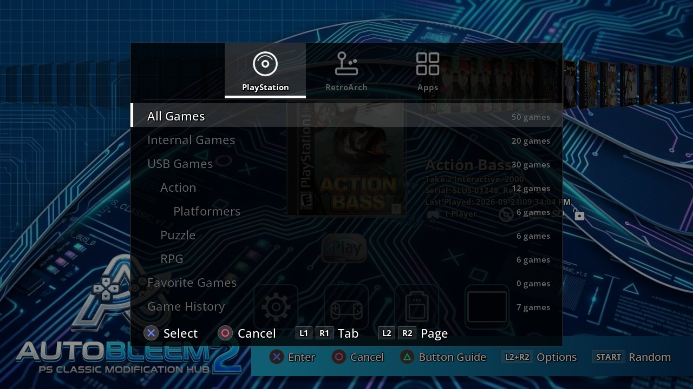

### 3.2 Steuerelemente

| Button | Auf dem Regal |
|---|---|
| Links / Rechts | Vorheriges / nächstes Spiel. Halten dreht es weiter. |
| L1 / R1 | Zum vorherigen / nächsten ersten Buchstaben der Titel springen. |
| Cross | Startet das ausgewählte Spiel (ein PS1-Spiel im PS1-Emulator; ein RetroArch-Spiel in seinem Core; eine App nach ihrer Anleitung). |
| Square | Startet das ausgewählte PS1-Spiel stattdessen in RetroArch. |
| Triangle | Der Button-Leitfaden. |
| Start | Ein zufälliges Spiel aus dem aktuellen Set. |
| Select | Der Set-Picker: PlayStation / RetroArch / Apps-Tabs (L1 / R1), die Gruppen des Tabs (Hoch / Runter, L2 / R2 eine Seite), Cross wählt. |
| Runter | Öffnet die Icon-Zeile unter dem Spiel (Einstellungen, Spiel, Memory Card, Fortsetzen). Hoch schließt es. |
| L2 + R2 | Das Systemmenü (Abschnitt 3.4). |

**Mit einer Tastatur** (ein PC ohne Pad oder eine USB-Tastatur auf der Console, einem Pi oder dem PC-Stick)
stehen die Tasten ein: **Pfeiltasten** = D-Pad, **Enter** = Cross, **Esc oder Backspace** = Circle, **Tab** =
Triangle, **Space** = Square, **F1 / F2** = Select / Start, **Page Up / Page Down** = L1 / R1, **Home / End** =
L2 / R2, **F10** = das Systemmenü. Auf einer Entwicklungsmaschine schließt Esc das Programm und Space ist Start.

In jeder Liste und jedem Menü: Hoch / Runter bewegen, **L2 / R2 drehen Seiten**, L1 / R1 springt zur ersten /
letzten Zeile, **Cross wählt, Circle geht zurück**. Ein Bildschirm mit Einstellungen speichert sie, wenn Sie
ihn mit Circle verlassen.

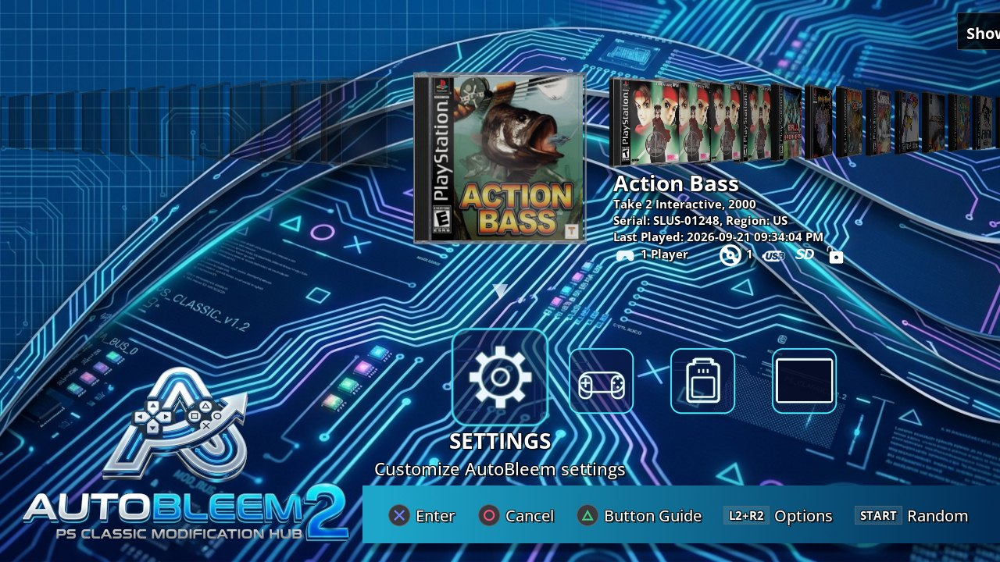

### 3.3 Die Sets

**Select** öffnet den Set-Picker. Der PlayStation-Tab listet *Alle Spiele*, *Interne Spiele* (die eingebauten
zwanzig der Console, auf einer PlayStation Classic), jeden Ordner, den Sie unter `Games/` gemacht haben (ein Spiel
in einem Unterordner gehört zu dieser Gruppe), *Lieblingsspiele*, *Spielverlauf* und, wenn ein Spiel als eines
gekennzeichnet ist, *Lightgun-Spiele*. Der RetroArch-Tab listet eine Gruppe pro System, das Spiele hat, plus
RetroArch's eigene Favoriten und Verlauf. Der Apps-Tab gruppiert Anwendungen nach Typ: *Alle Apps*, dann
*Spiele*, *Emulatoren*, *Tools*, *Medien* und *Andere* (die Kategorie wird in jeder App's `app.ini` gesetzt).
Jede Zeile zeigt, wie viele Elemente sie hält; eine Gruppe ohne öffnet sich auf einem leeren Regal mit der
Icon-Zeile nur Einstellungen zeigend.

### 3.4 Das Quick-Menü

**Hoch** im Launcher oder das **Zahnrad-Icon** in der Icon-Zeile (wo Einstellungen / Spiel / Memory Card /
Fortsetzen sind): das Quick-Menü für Aktionen, die Sie vom Carousel erreichen. Eine kurze Liste: *Spiele
neu scannen* (startet einen Scan jetzt), *Store* (der AutoBleem Store zum Herunterladen von Erweiterungen),
*Netzwerk & Controller* (nur wo eine installierte Erweiterung den `network`-Eintrag bereitstellt - PSC-Bios
auf der Console, einem Pi und dem PC-Stick: WiFi, Bluetooth-Pairing, der Gamepad-Zuordnungs-Assistent - siehe
Abschnitt 6; grau bei "im Extensions aktivieren", wenn diese Erweiterung deaktiviert ist - Cross öffnet die
Extensions-Liste), und *Systemmenü...* (das volle Menü unten). Hoch / Runter bewegen (umhüllt), Cross wählt,
Circle zurück. Nichts ist hier einzigartig - jedes Element ist auch im Systemmenü.

### 3.5 Das Systemmenü

**L2 + R2** (zusammen, in jeder Reihenfolge) öffnet das Systemmenü über dem Regal. Das Menü ist in Abschnitte
gruppiert:

| Abschnitt | Element | Was es macht |
|---|---|---|
| (oben) | Spiele neu scannen | Schaut jetzt nach neuen, geänderten oder entfernten Spielen (der Scan beobachtet auch den Ordner selbst). |
| | Erweiterungen | Die Erweiterungen auf dem Stick - der AutoBleem Store und andere (Abschnitt 3.12). |
| **Bibliothek** | Spiel-Manager | Die PS1-Spiele als Liste mit ihren Ordnern: Löschen Sie ein Spiel, leeren Sie die Cover. Deaktiviert während eines Scans. |
| | Memory Cards | Ihre Memory-Card-Sets (Abschnitt 3.7). |
| | Scanner-Prozessoren | Die Programme, die jeder Scan zuerst ausführt - ihre Reihenfolge, an oder aus (Abschnitt 3.13). Deaktiviert während eines Scans. |
| **System** | Optionen | AutoBleems Einstellungen (Abschnitt 3.6). |
| | Netzwerk & Controller | Nur wo eine installierte Erweiterung den `network`-Eintrag bereitstellt (`Provides=network` in ihrem `extension.ini` - PSC-Bios auf der Console, einem Pi und dem PC-Stick) - WiFi, Bluetooth-Controller-Pairing, DualShock 3-Setup und der Gamepad-Zuordnungs-Assistent - siehe Kapitel 6. Wenn diese Erweiterung installiert aber deaktiviert ist, bleibt dieses Element grau mit einer Notiz "im Extensions aktivieren" - Cross öffnet die Extensions-Liste. |
| | Hardware-Informationen | Die Fakten der Maschine: System, CPU, Speicher, Netzwerk-Schnittstellen, Zeitzone, Display, die Pads und ihre Zuordnungen. Auf einer Console mit AutoBleem-Kernel öffnet dies PSC-Bios (Kapitel 6); auf anderen Maschinen zeigt dies diese Informationsseite. |
| | Software-Update | (Raspberry Pi und PC) Überprüfen Sie die Website jetzt auf ein neueres AutoBleem oder RetroArch. |
| | Über | Credits und Lizenz. |
| **Verlassen** | RetroArch | Verlässt den Launcher für RetroArch's eigenes Menü. Schließen von RetroArch kommt zurück. |
| | Ausschalten | Nach einer Bestätigung: auf der Console AutoBleems Standby - der Stick getrennt, das Licht rot, Power bringt den Launcher zurück (Abschnitt 2.1); auf einem Pi oder PC fährt die Maschine herunter. |

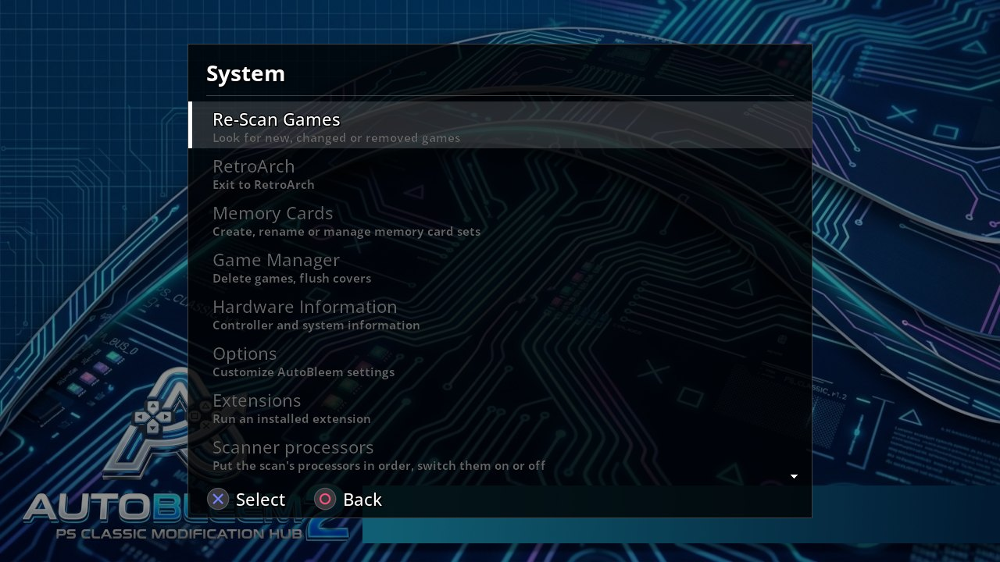

### 3.6 Optionen

Die Einstellungen sind in Gruppen; Hoch / Runter bewegen zwischen ihnen, Links / Rechts ändern einen Wert,
Circle verlässt und speichert. Jede Änderung wird sofort angewendet.

| Gruppe / Einstellung | Was es macht |
|---|---|
| **Schnittstelle**: AutoBleem Theme | Das Aussehen. Designs leben in `Themes/`; ein Designs-Zip dort abgelegt wird beim nächsten Besuch entpackt. Die Designs, die AutoBleem mitliefert, werden mit jedem Update aufgefrischt - um eines anzupassen, kopieren Sie es zuerst unter einen neuen Namen. |
| Cover-Stil | Der Jewel-Case-Rahmen, der um PS1-Cover gezeichnet wird. |
| Sprache | Die Launcher-Sprache, sofort angewendet (17 Sprachen). |
| Font aus Theme verwenden / Font | Der klassische Bildschirm-Font: der des Designs oder jede `.ttf`/`.otf` aus `resources/fonts`, `RetroArch/fonts` oder dem Designs-Ordner. |
| Anzeige-Timeout | Wie lange die "Zeige: ..." Benachrichtigung bleibt, in Sekunden (0 = immer). |
| **Sound**: Musik, Hintergrundmusik | Welcher Track unter dem Launcher spielt (der des Designs oder eine Datei aus `resources/music`), und ob überhaupt einer spielt. |
| **Emulation**: PS1-Emulator | `pcsx-abnxt` (Standard: aktueller PCSX-ReARMed mit AutoBleems Zusätzen) oder `pcsx-ab` (der klassische). Ein Fortsetzungspunkt, der von einem gespeichert wird, setzt sich im anderen fort, es sei denn, das Spiel lief ohne BIOS-Datei. |
| Widescreen | Die PS1-Emulator-Bildform für jedes Spiel. |
| Alle PSX-Spiele mit RA spielen | Jedes PS1-Spiel startet in RetroArch's PS1-Core. |
| RA-Konfiguration aktualisieren | AutoBleem schreibt seine Einstellungen in RetroArch's Konfiguration, wenn es dort ein Spiel startet. |
| **Bibliothek**: Interne Spiele anzeigen | Die eingebauten Spiele der Console in den PlayStation-Listen (nur PlayStation Classic). |
| Box Art online abrufen | Der Scan ruft fehlende Cover von libretro's Servern ab (Raspberry Pi, PC, Windows). |
| **Updates** | (Raspberry Pi, PC, Windows) `stable`, `latest` (auch die Pre-Releases) oder `off`. |

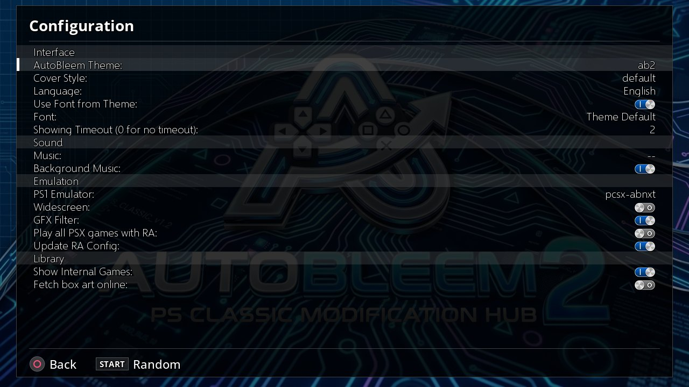

### 3.7 Einstellungen eines Spiels

Mit einem ausgewählten Spiel öffnet **Runter** seine Icon-Zeile: **Einstellungen** (die Optionen oben), **Spiel**
(die eigenen Einstellungen des Spiels), **Memory Card** (seine Memory Card) und **Fortsetzen** (seine Save States).
Cross öffnet die, die sich unter dem Cursor befindet.

Der **Spiel-Editor** zeigt die Details des Spiels rechts und seine Einstellungen links, in drei Gruppen:

- **Spiel**: *Favorit* (in der Lieblingsspiele-Gruppe), *Lightgun-Spiel* (ein Light-Gun-Spiel - es tritt der
  Lightgun-Gruppe bei und läuft immer in RetroArch, dessen PS1-Core den GunCon hat), *Mit RA spielen* (dieses
  Spiel läuft in RetroArch), *Daten sperren* (der Scanner lässt den Spieltitel, die Seriennummer und die Liste
  der Discs so, wie Sie sie gesetzt haben).
- **Video**: hohe Auflösung, Scanlines und ihre Stufe, Frame-Skip, das GPU-Plugin, und den *Filter* - wie das
  Bild skaliert wird: Aus (einfache Pixel), Linear (geglättet) oder Sharp (scharfe Pixel ohne Flimmern;
  nur `pcsx-abnxt` - die klassische `pcsx-ab` und RetroArch zeigen es als Aus).
- **Emulator**: SpeedHack, die CPU-Taktung, SPU-Interpolation, das Boot-Logo (aus überspringt die BIOS-Shell -
  für eine Homebrew-Disc, deren benutzerdefinierten Logo das Boot unterbricht), und mit `pcsx-abnxt` den
  *Smoothing*-Filter und den *Sony hacks*-Toggle.

Triangle benennt das Spiel um, Square ändert seine Memory Card, Start teilt eine neue Card. Circle speichert
und verlässt.

**Einstellungen im Emulator gespeichert.** Das eigene Menü des Emulators hat *Einstellungen für dieses Spiel
speichern*. Sobald ein Spiel dort gespeicherte Einstellungen hat, sind dies die, mit denen es spielt, und der
Spiel-Editor zeigt seine Video- und Emulator-Zeilen grau, mit diesen Werten, unter der Überschrift *Im Emulator
gespeichert*. Um zu den Einstellungen des Spiel-Editors zurückzukehren, wählen Sie **Einstellungen entsperren**
und bestätigen: dies löscht die Einstellungen, die der Emulator gespeichert hat, und die Zeilen können wieder
geändert werden. Beide Emulatoren, `pcsx-ab` und `pcsx-abnxt`, lesen und schreiben die gleichen gespeicherten
Einstellungen.

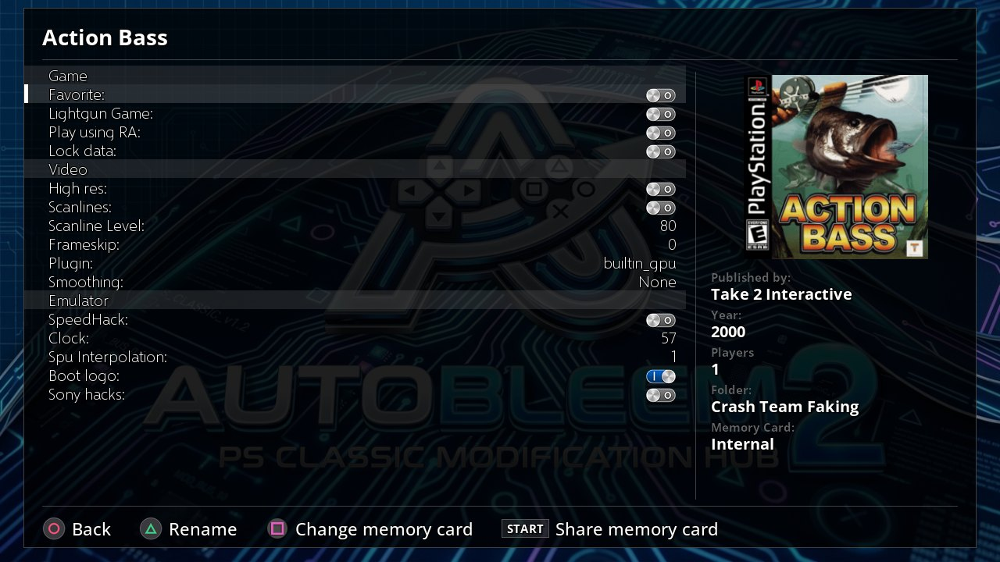

### 3.7 Memory Cards und Save States

Jedes PS1-Spiel hat standardmäßig seine eigene Memory Card (behalten mit seinen Save States in `Games/!SaveStates/<Spielordner>/`).
**Memory Cards** im Systemmenü verwaltet **freigegebene Sets** - eine Card, die mehrere Spiele verwenden, behalten
in `Games/!MemCards/`: erstellen Sie eine (Square, mit der On-Screen-Tastatur), benennen Sie um (Cross), löschen
Sie (Triangle). Ein Spiel wird mit *Memory Card wechseln* in seinem Editor oder von seinem Memory Card-Icon auf
einen Set gestellt.

Der **Memory-Card-Editor** (das Memory Card-Icon) zeigt die Card des Spiels und eine zweite Card nebeneinander,
mit jedem Save-Icon und -Titel: kopieren Sie einen Save zwischen den beiden (Square), löschen Sie einen (Triangle),
defragmentieren Sie eine Card (Select). Start tauscht die Card auf der rechten Seite gegen einen anderen Set.

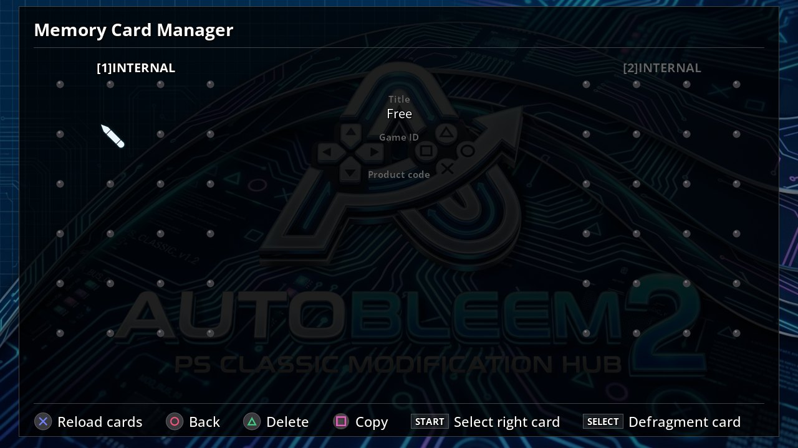

**Fortsetzungspunkte**: Wenn Sie ein PS1-Spiel mit der Reset-Taste der Console verlassen (oder das Menü des
Emulators auf einem Pi oder PC), behält AutoBleem einen Save State, wo Sie waren, und bietet ihn unter dem
**Fortsetzen**-Icon an - vier Slots, jede mit einem Bild des Moments. Cross setzt einen aus dem Slot fort,
Triangle löscht ihn. Ein Spiel mit einem Fortsetzungspunkt zeigt ein kleines Bild auf seinem Resume-Icon.

### 3.8 Starten von Spielen, RetroArch und Apps

**Cross** startet das ausgewählte Spiel. Ein PS1-Spiel läuft im gewählten PS1-Emulator (Abschnitt 3.5),
Vollbildschirm, bis Sie ihn verlassen - auf der Console mit der vorderen **Reset**-Taste (zurück zum Launcher
mit einem Fortsetzungspunkt) oder **Power** (die Console schaltet sich aus); auf einem Pi oder PC durch das
Menü des Emulators (Select + Start auf dem Pad oder Esc auf einer Tastatur). **Square** startet ein PS1-Spiel
stattdessen in RetroArch.

Ein **RetroArch**-Spiel startet in RetroArch mit dem Core, den der Launcher für sein System gewählt hat; *Inhalt
schließen* oder *RetroArch beenden* in seinem Menü kommt zum Launcher zurück. Das RetroArch-Element im Systemmenü
öffnet RetroArch's eigenes Menü (XMB) mit nichts geladen, für seine Einstellungen und seine eigenen Inhaltslisten.

Eine **App** (das Apps-Set: die Console-Tools und auf einer Console die zusätzlichen Anwendungen, die RetroArch's
Paket bringt - Doom, Quake, Amiga, ...) zeigt zuerst ihre Anleitung; Cross startet sie, Circle geht zurück.

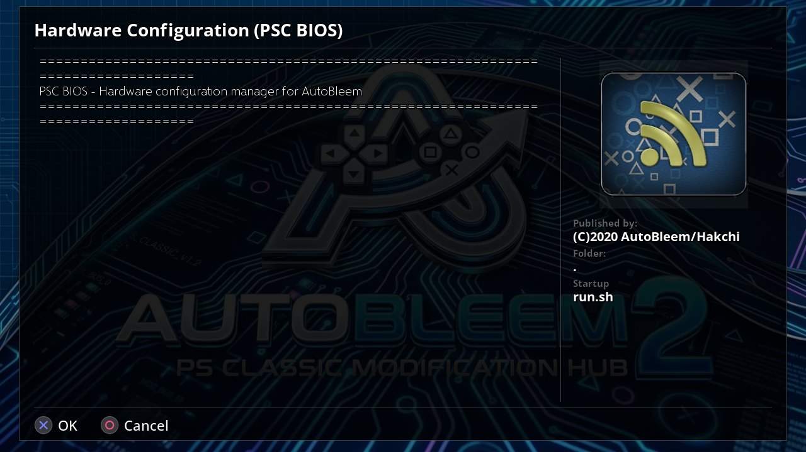

### 3.9 Spiele hinzufügen

**PS1-Spiele** gehen in den `Games`-Ordner, **einen Ordner pro Spiel**, benannt nach dem Spiel:

```
Games/
  Crash Bandicoot/            Crash Bandicoot.cue + Crash Bandicoot.bin
  Final Fantasy VII/          Final Fantasy VII (Disc 1).chd, (Disc 2).chd, (Disc 3).chd
  Platformers/                ein Ordner von Spielen: eine eigene Gruppe im Set-Picker
    Klonoa/                   Klonoa.pbp
```

- Formate: `.cue` + `.bin` (oder `.img`), `.pbp`, `.chd` (auch zstd), `.ecm` (vom Scan dekodiert), `.iso`.
  Ein gezipptes Spiel funktioniert auch: der **Unzip**-Prozessor entpackt es vor dem Scan (Abschnitt 3.13).
- Ein Multi-Disc-Spiel ist ein Ordner mit jedem Disc darin; Ordner, benannt `Game (Disc 1)`, `Game (Disc 2)`
  ... werden vom Scan zu einem `Game`-Ordner zusammengefasst.
- Spiele, die direkt in `Games/` abgelegt werden (lose Dateien), werden vom Scan in Ordner nach Spiel sortiert.
- Ein **Cover** ist ein PNG neben dem Spiel-Image, benannt wie dieses. Ohne eines kommt die Schachtelart aus den
  Cover-Datenbanken oder - mit RetroArch installiert - aus libretro's Thumbnail-Set; auf einem Pi, PC oder
  Windows wird ein fehlender Online abgerufen (Optionen → *Box Art online abrufen*).
- Der Scan liest die Seriennummer jeder Disc und nimmt den Titel, Publisher, Jahr, Spieler und Region aus
  RetroArch's PlayStation-Datenbank oder den Cover-Datenbanken. Ändern Sie alles im Spiel-Editor und wählen Sie
  *Daten sperren*, um es zu halten.

**Andere Systeme** gehen unter `RetroArch/roms/`, **ein Ordner pro System, benannt wie RetroArch's Datenbanken
sind** (der Ordner wird für Sie erstellt): `Nintendo - Nintendo Entertainment System`, `Nintendo - Super Nintendo
Entertainment System`, `Sega - Mega Drive - Genesis`, `Nintendo - Game Boy Advance`, `FBNeo - Arcade Games`
(oder `Arcade`), ... ROMs können gezippt bleiben. Auf einem Pi, PC oder Windows liest der Scan sie selbst und
schreibt RetroArch's Spiellisten; auf einem Console-Stick führen Sie **UpdateRoms** auf dem PC aus (Kapitel 5).

**Apps** gehen unter `Apps/<name>/` mit einer `app.ini` (der Name, das Icon, was zu laufen ist) und einer
`run.sh`.

**Designs** gehen unter `Themes/<name>/` (`theme.json` und die Bilder) - oder legen Sie das Designs-Zip in
`Themes/`.

### 3.10 Die PS1-BIOS

Auf einer **PlayStation Classic** nutzt der Emulator die eigene BIOS der Console. Auf einem **Raspberry Pi,
PC und Windows** legen Sie Ihre eigene PS1-BIOS in `System/Bios/`: `romw.bin` (die US/Europäische SCPH-5501/5502)
und `romJP.bin` (die Japanische SCPH-5500). Die Installer füllen sie aus den RetroArch-BIOS-Paketen, es sei
denn, Ihre eigenen Dateien sind bereits da. Ohne diese läuft der Emulator auf seiner eingebauten HLE-BIOS,
die viele Spiele tolerieren und einige nicht.

### 3.11 Updates

- **Raspberry Pi, PC-Stick, Windows**: Der Launcher überprüft die Website beim Start und einmal täglich (Optionen
  → *Updates* ist der Kanal; *Software-Update* im Systemmenü überprüft jetzt). Wenn es ein neueres AutoBleem
  oder RetroArch gibt, fragt es: *Jetzt aktualisieren* lädt alles herunter und führt den Installer mit dem
  Fortschrittsbildschirm des ersten Starts erneut aus; *Morgen erinnern* und *Diese Version überspringen* sind
  die anderen Antworten. Ihre Spiele und Einstellungen bleiben; der Launcher scannt einmal nach einem Update
  erneut.
- **PlayStation Classic**: Führen Sie einen neueren `AutoBleemInstaller.exe` über dem Stick aus (Abschnitt 2.1).

### 3.12 Erweiterungen und der AutoBleem Store

**Erweiterungen** addieren ihre eigenen Bildschirme zum Launcher. Sie leben in `Extensions/<name>/` auf dem Stick
(auf einem Raspberry Pi seiner Datenpartition, auf Windows dem Datenordner); um eine zu installieren, entpacken
Sie sein Zip dort. **L2 + R2 → Erweiterungen** listet sie auf: Cross startet eine, Triangle schaltet sie aus oder
wieder ein. Eine Erweiterung, die das Netzwerk benötigt, wird nicht ohne eines gestartet, und eine, die den
Launcher stoppte, wird ausgeschaltet - die Liste sagt es.

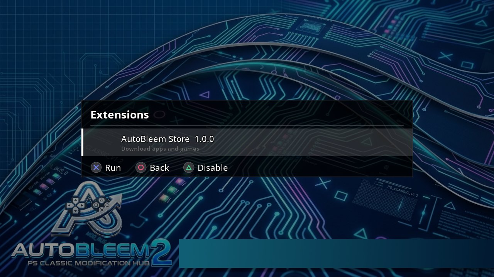

**Der AutoBleem Store** ist die erste Erweiterung: Apps und Spiele zum Installieren mit einem Druck, auf jedem
System, auf dem AutoBleem läuft (eine PlayStation Classic benötigt das WiFi des AutoBleem-Kernels). Seine vier
Tabs, L1 / R1 dazwischen:

- **Apps** und **Spiele**: das, das die Quellen anbieten, jeder mit seinem Bild, Version, Größe und Quellen-Favicon.
  Installierte Elemente sind grau. Cross installiert (oder aktualisiert oder versucht wieder nach einem Fehler),
  Triangle entfernt, das der Store installiert hat. L2 / R2 oder Links / Rechts drehen Seiten, **Select** zeigt
  eine Quelle auf einmal, **Start** durchsucht die Titel. Elementbilder sind gecacht und können erneut versucht
  werden, wenn sie nicht geladen werden.
- **Downloads**: was heruntergeladen wird, wartet, fehlgeschlagen oder installiert ist. Die Fortschrittsleiste
  aktualisiert sich stetig. Downloads gehen im Hintergrund auch nach dem Verlassen des Stores weiter; ein Spiel
  oder Ausschalten pausiert nur sie, und ein gestoppter Download wird fortgesetzt, wo er gestoppt ist. Ein
  installiertes Spiel erscheint auf dem Regal nach dem nächsten Scan mit dem Store-Bild als Cover. Downloads über
  2 GB funktionieren auf allen Plattformen, einschließlich 32-Bit-Builds.
- **Quellen**: von wo die Listen kommen - AutoBleems eigener Katalog, eine TSV-Liste in `System/Extensions/store/sources/`
  abgelegt und die Adressen, die Sie mit **Quellen-URL hinzufügen** hinzufügen. Jede Quelle zeigt sein Favicon
  in der Liste. Cross auf einem, das Sie hinzugefügt haben, benennt es um, ändert seine Adresse, wechselt zwischen
  `http://` und `https://` oder entfernt es.

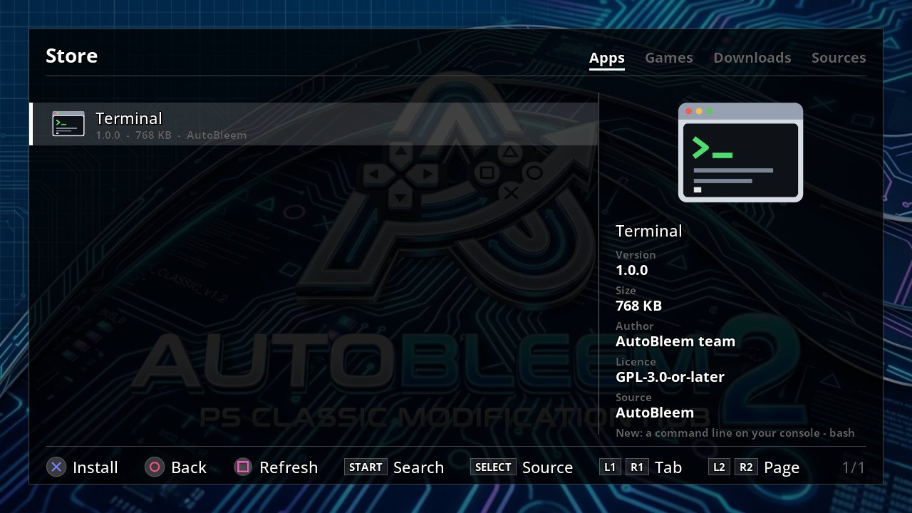

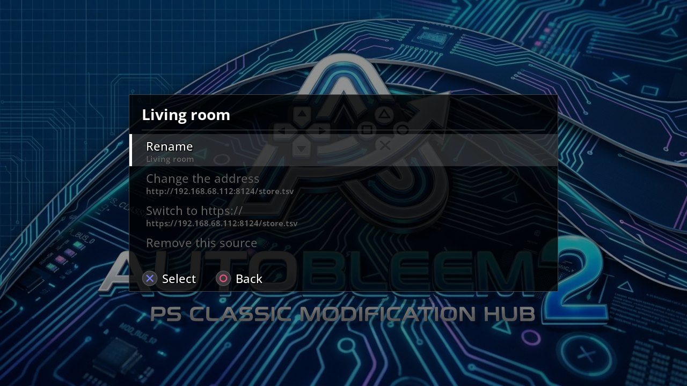

Was AutoBleems Katalog anbietet, ist auch auf der Download-Website aufgelistet, `https://autobleem.retromenele.pl/store/`.
**Sie sind verantwortlich für das, was die Quellen, die Sie hinzufügen, enthalten.**

**Ihre eigenen Spiele in Ihrem Netzwerk**: `abstored`, der LAN-Server des Stores, bedient einen Ordner von PS1-Spielen
an den Store im gleichen Netzwerk. Es läuft auf jeder Linux-Maschine - einem Raspberry Pi, einem Home-Server - und
liest nur den Ordner. Starten Sie es mit `abstored <Spielordner>`, öffnen Sie `http://<jene Maschine>:8124/` in
einem Browser, um zu sehen, was es bedient und alle Probleme, die es fand, und fügen Sie `http://<jene Maschine>:8124/store.tsv`
als Quelle hinzu. Fertige Programme für Linux und Windows sind auf der Store-Seite in ihrer **LAN-Server**-Tab;
die Einrichtung als Service ist `INSTALL-linux.md` (`ext_store/server/` in der Quelle). **LAN Share** (Abschnitt 5.2)
legt Spiele und Discs von einem PC auf solchen Server.

### 3.13 Scanner-Prozessoren

**Scanner-Prozessoren** sind kleine Programme, die jeder Scan vor dem Lesen Ihrer Spiele ausführt. Einer kann ein
Format, das AutoBleem nicht liest, in eines umwandeln, das es tut - ein gezipptes Spiel, zum Beispiel - oder die
Daten eines Spiels ändern, wie einen Übersetzungs-Patch. Sie leben in `System/Processors/<name>/` auf dem Stick
(auf einem Raspberry Pi seiner Datenpartition, auf Windows dem Datenordner); um einen zu installieren, entpacken
Sie seinen Ordner dort. Der nächste Scan führt ihn aus.

- **Unzip kommt mit AutoBleem**: Es entpackt gezippte PS1-Spiele in `Games/` vor dem Scan liest sie und gezippte
  ROMs eine auf einmal (Arcade-Sets bleiben gezippt). Das Aktualisieren von AutoBleem aktualisiert es auch und
  hinterlässt es ausgeschaltet, wenn Sie es ausgeschaltet haben.
- Ein Prozessor, der bereits mit einem Spiel fertig ist, wird nicht darauf ausgeführt, bis sich das Spiel
  ändert.
- Während ein Prozessor arbeitet, zeigt die Blase oben rechts, was er tut; eine Warnung oder ein Fehler erscheint
  auf der Zeile darunter. `processors.log` im Protokoll-Ordner hat die Details.
- Das Starten eines Spiels oder RetroArch stoppt einen Prozessor, der Dateien ändert; der nächste Scan beendet
  seine Arbeit.

**L2 + R2 → Scanner-Prozessoren** zeigt sie in der Reihenfolge, in der sie laufen, ein Tab für die PS1-Spiele
und eines für die ROMs (L1 / R1). **Square** wählt einen Prozessor auf und Hoch / Runter bewegt ihn - die
Reihenfolge zählt: ein Prozessor, der entpackt, muss vor einem kommen, der das Entpackte patcht. **Cross**
schaltet einen aus oder ein, **Triangle** lässt ihn bei jedem nächsten Scan auf jedes Spiel schauen, **Circle**
geht zurück und startet einen Scan, wenn Sie etwas geändert haben. Ein Prozessor, gebaut für eine andere Maschine,
bleibt auf der Liste, grau.

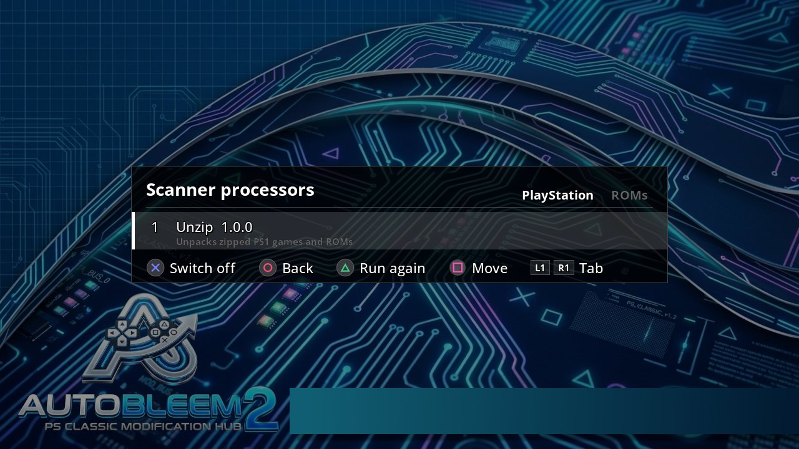

Eine eigene schreiben: Unzip's Seite, `https://github.com/autobleem2/proc_unzip`, erklärt alles, das ein
Prozessor tun muss, und `tools/proc_check.py` in AutoBleem's Quelle überprüft einen vor dem Teilen.

<!-- pagebreak -->

## 4. Bildschirme

### 4.1 Spiel-Manager

Die PS1-Spiele als Liste mit ihren Ordnern und das ausgewählte mit Cover und Details. Cross öffnet den
Spiel-Editor, **Square löscht das Spiel** (seinen Ordner und, nach einer zweiten Frage, seine Save States),
Triangle löscht jedes Cover-PNG neben den Spielen (der Scan nimmt sie wieder aus den Datenbanken), L2 / R2
Seite. Der freie Platz des Laufwerks ist oben rechts. Der Spiel-Manager wartet, während ein Scan läuft.

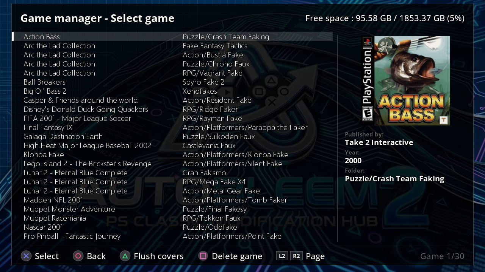

### 4.2 Hardware-Informationen

Die Fakten der Maschine - System, Hardware, Speicher mit seinem freien Platz, Netzwerk-Adressen, die Display-
und Audio-Treiber, die verbundenen Pads - neu gelesen jede Sekunde. Auf einer PlayStation Classic mit dem
AutoBleem-Kernel öffnet dieses Element stattdessen **PSC-Bios** (Kapitel 6).

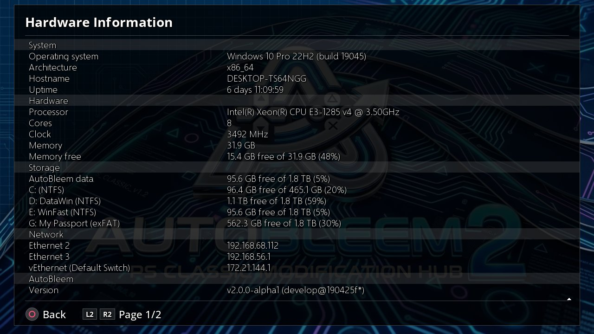

### 4.3 Der Button-Leitfaden

Triangle auf dem Regal: jeder Button von jedem Bildschirm auf einer Seite. Wenn eine USB-Tastatur verbunden ist
oder verwendet wurde, zeigt eine Tastatur-Spalte die Tasten neben den Pad-Tasten.

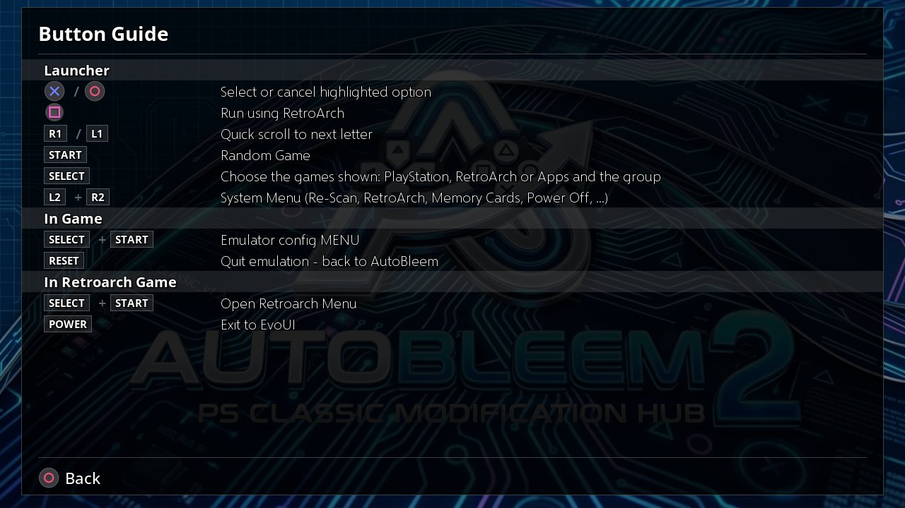

### 4.4 Die On-Screen-Tastatur

Überall dort, wo Text eingegeben wird - eine Memory-Card-Set, ein Spieltitel, ein WiFi-Passwort, eine Quellen-Adresse
- die gleiche Tastatur, ausgelegt wie die eines Telefons: Buchstaben, eine Seite von Symbolen (`/ \ : ? & = % @ #`
und der Rest, den eine Adresse oder ein Passwort benötigt) und zwei Seiten von Akzentbuchstaben, mit Shift, der
Seite-Taste, Space, Backspace und Bestätigung auf der unteren Zeile. Die Richtungen bewegen, Cross tippt,
Triangle löscht, Square ist ein Space, **L1** ist Shift (zweimal für Großschreibung), **R1** die nächste Seite,
**L2 / R2** bewegen den Cursor, Start bestätigt, Circle bricht ab. Eine USB-Tastatur tippt jederzeit: Enter
bestätigt, Esc bricht ab.

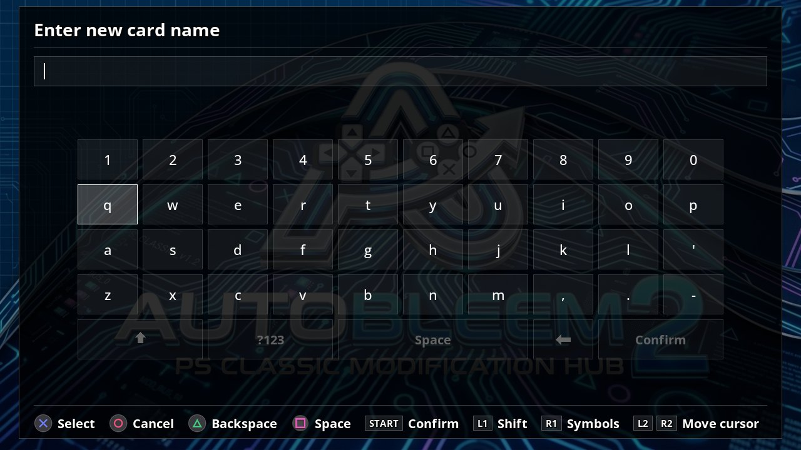

<!-- pagebreak -->

## 5. Auf dem PC

### 5.1 UpdateRoms - Aktualisieren eines Console-Sticks

Die PlayStation Classic hat kein Netzwerk, so dass die RetroArch-Listen und Schachtelmuster ihres Sticks auf dem
PC gemacht werden: **UpdateRoms** tut auf dem PC, was der Launcher-Scan auf einem Pi tut, mit dem Netzwerk des
PC und den Wegen der Console, so dass die Console bootet und alles auf Platz findet.

1. Kopieren Sie Ihre ROMs auf den Stick unter `RetroArch/roms/<System>/` (Abschnitt 3.9). Die Ordnernamen müssen
   RetroArch's Datenbank-Namen sein; der Installer macht die gewöhnlichen.
2. Starten Sie **`UpdateRoms\UpdateRoms.exe` vom Stick** (der Installer hat es dort eingefügt). Es findet den
   Stick davon, wo er sitzt, zeigt eine Etappen-Zeile, eine Fortschrittsleiste und ein Protokoll, und:
   - lädt RetroArch's Datenbank-Bündel herunter, wenn der Stick keines hat, und identifiziert jedes ROM von
     ihm - ein Spiel, das die Datenbank kennt, bekommt seinen richtigen Namen;
   - schreibt eine Spielliste pro System in `RetroArch/bin/playlists/` mit den Wegen der Console, behält alles,
     was RetroArch selbst dort addiert hat;
   - ruft die Schachtelmuster von jedem ROM, das keines hat, von libretro's Thumbnail-Servern in
     `RetroArch/bin/thumbnails/` ab.
3. Nehmen Sie den Stick sicher heraus und schieben Sie ihn zurück in die Console. Die RetroArch-Tab des Set-Pickers
   listet jedes System auf, das Spiele hat.

Führen Sie ihn erneut aus nach jedem Change zu den ROM-Ordnern; ein Ordner, dem nichts geändert ist, wird
übersprungen, so dass eine erneute Ausführung schnell ist. Das Protokoll ist `System/Logs/updateroms.log`. Eine
Raspberry Pi-Karte in einem Kartenleser kann die gleiche Weise aufgefrischt werden (`UpdateRoms.exe <Laufwerk>
--target rpi`), obwohl ein Pi dies selbst tut, wenn es ein Netzwerk hat.

### 5.2 LAN Share - Ihre Spiele und Discs auf dem Server in Ihrem Netzwerk

**LAN Share** (`LanShare.exe`, auf der Store-Seite in ihrer **LAN-Server**-Tab) legt Ihre PS1-Spiele auf den
Server des Stores in Ihrem Heimnetz - ein `abstored` auf einem Raspberry Pi, NAS oder einem anderen PC - und liest
eine PS1-Disc im CD/DVD-Laufwerk des PC. Der Store auf der Console, dem Pi oder dem PC installiert sie dann
von dort. Nichts zum Installieren; die Einstellungen werden in `%LOCALAPPDATA%\AutoBleem LAN Share\` gehalten.


1. **Der Server**: Geben Sie seine Adresse (`http://<seine Adresse>:<Port>`, wie der Store ihn hat) ein und drücken
   Sie **Verbinden**. Seine Spiele und alle Probleme, die sein Scan fand, sind auf der linken Seite aufgelistet.
   Um Spiele darauf zu legen, geben Sie eines davon:
   - **Freigeben** - der Spiele-Ordner des Servers, wie er im Netzwerk geteilt ist (Samba), z.B. `\\raspberrypi\games`:
     LAN Share kopiert die Spiele dorthin und bittet den Server zu scannen. Der Server selbst bleibt nur-lesbar.
   - **Token** - wenn der Server mit `--allow-uploads` gestartet wurde: sein Token (der Server druckt es beim Start
     und behält es in `<state>/upload-token`). LAN Share lädt über HTTP und ein gestoppter Upload geht auf, wo
     er gestoppt ist.
2. **Spiele auf diesem PC**: Wählen Sie einen Ordner von Spielen (ein Ordner pro Spiel), wählen Sie Spiele und
   drücken Sie **Geben Sie die gewählten Spiele frei**. **Auf dem Server** sagt, ob der Server ein Spiel bereits hat
   (von seiner Seriennummer, sonst von seinem Titel); ein solches Spiel wird nie zweimal gesendet. **Wählen Sie die
   nicht auf dem Server**, wählt den Rest.
3. **Eine Disc**: Legen Sie eine PS1-Disc in das Laufwerk und drücken Sie **Lesen Sie eine Disc und geben Sie sie frei**.
   Die Disc wird ganz in einen `.bin` + `.cue` (und einen `.sbi` für ein LibCrypt-Spiel, wenn das Laufwerk den
   Subkanal gibt) gelesen, benannt nach seinem Titel, überprüft gegen den bekannten guten Dump (wenn die Datenbanken
   gewählt sind) und freigegeben. Für ein Spiel auf mehreren Discs wählen Sie **Das Spiel hat mehr als eine Disc**:
   LAN Share fragt nach jeder nächsten Disc und gibt sie zusammen als ein Spiel frei.
4. **Von dem Server entfernen...** nimmt die ausgewählten Spiele aus dem Server. Nichts wird gelöscht: jede wird in
   einen `.removed`-Ordner neben den Spielen des Servers bewegt und das Zurückbewegen setzt sie zurück.

Die **Datenbanken** - AutoBleems Cover-Ordner (`coversU/P/J.db`) und RetroArch's `Sony - PlayStation.rdb` - geben
die Titel und die Überprüfung einer gelesenen Disc; beide sind optional. **Geben Sie auch die Spiele auf diesem PC
mit dem Store frei** (standardmäßig aus) bedient den Ordner auf diesem PC dem Store direkt. Das erste Mal fragt
Windows über seine Firewall: nur private Netzwerke erlauben.

<!-- pagebreak -->

## 6. Die Console Tools (PlayStation Classic)

Zwei Tools für einen PlayStation Classic-Stick. Beide zeichnen im Design und der Sprache des Launchers und beide
werden vom Pad getrieben - und im Gamepad-Wizard von den vorderen Tasten der Console. **PSC-Bios** ist eine
Erweiterung, die mit dem Console-Paket kommt: *Hardware-Informationen* im Systemmenü öffnet es, und es ist
in der Erweiterungs-Liste. **ABFlashKit** ist eine App im Apps-Set.

### 6.1 PSC-Bios

Eine Erweiterung, die mit dem Console-Paket kommt, auch auf einem Raspberry Pi und dem PC-Stick verfügbar.
Sie wird vom Punkt *Netzwerk & Controller* des Systemmenüs geöffnet (oder von der Erweiterungs-Liste). Wenn
diese Erweiterung installiert aber deaktiviert ist, ist der Punkt *Netzwerk & Controller* im Quick-Menü und
Systemmenü grau mit einer Notiz "im Extensions aktivieren" - Cross dort öffnet die Erweiterungs-Liste.

Der Öffnungsbildschirm zeigt Maschinen-Fakten: Zeit, Zeitzone, WiFi/Ethernet/Bluetooth-Netzwerk-Adapter mit
ihren Adressen und jeder verbundenen Controller mit, ob er eine Button-Zuordnung hat. Die Netzwerk- und
Bluetooth-Teile benötigen den AutoBleem-Kernel auf der Console (Abschnitt 6.2) oder System-Tools auf einem
Raspberry Pi / PC-Stick; der Gamepad-Wizard funktioniert auf jedem System.

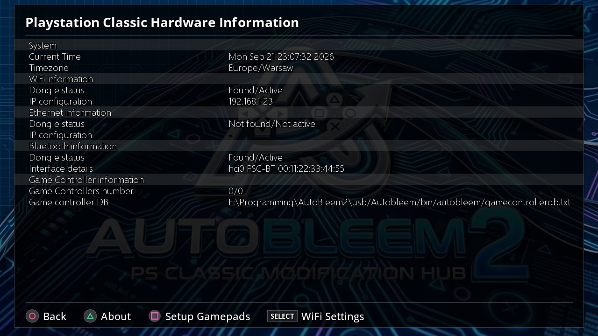

- **Select - WiFi-Netzwerk** (Kernel oder NetworkManager): der Netzwerk-Name (eingegeben oder aus einem Scan
  gewählt), Passwort, Treiber-Modus und *Übernehmen / Netzwerk neu starten*. Die Zeitzone wird auch hier
  eingestellt. Die IP-Adresse der Console wird einmal verbunden angezeigt.
- **Square - Bluetooth-Controller**: ein Scan für Bluetooth-Gamepads (DualShock 4, etc.), um zu koppeln oder
  zu entfernen.
- **L1 - DualShock 3-Kopplung**: USB-nur-Verbindung für den ersten DualShock 3, durch den Sixaxis-Plugin des
  Kernels.
- **R1 - Controller-Zuordnung**: der Zuordnungs-Wizard (unten).
- **Triangle - Über**, **Circle - zurück** zum Launcher.

**Der Gamepad-Wizard** zeigt das verbundene Pad roh - jede Achse, Button und Hat als Nummern, und ein DualShock-Bild,
das aufleuchtet, wenn Sie drücken. Da der getestete Pad nicht vertraut werden kann, wird der Wizard von den
**vorderen Tasten der Console** getrieben: **RESET** wechselt zum nächsten Pad, **OPEN** startet die Zuordnung
(dann beantwortet jede Frage - drücken Sie den Button, der auf dem Bild leuchtet, oder OPEN, wenn das Pad diesen
Button nicht hat), **POWER** bricht ab oder verlässt. Wer Circle auf dem Pad 2 Sekunden lang hält, verlässt den Wizard
(ein Balken füllt sich und der Footer-Hinweis sagt "2 Sekunden halten: Beenden"). Solange das Pad noch keine Zuordnung
hat, genügt es, einen beliebigen Button 2 Sekunden zu halten ("Beliebigen Button 2 Sekunden halten: Beenden"). Ein kurzer Druck wird normal
zugeordnet. Auf einer Tastatur stehen Esc / Space / Enter für POWER / RESET / OPEN ein. Am Ende wird die neue
Zuordnung zum Test hinzugefügt und OPEN speichert es unter einem Namen Ihrer Wahl; der Launcher lädt es von dann
an.

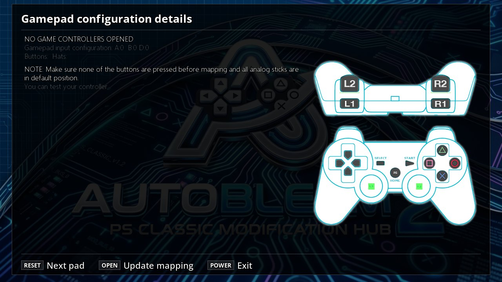

### 6.2 ABFlashKit - Der AutoBleem-Kernel

Der AutoBleem-Kernel ist ein optionaler Ersatz des Linux-Kernels der Console: Er bringt eine funktionierende
Uhr, USB-WiFi und Bluetooth-Dongles (für PSC-Bios und Bluetooth-Pads) und die Unterstützung der vorderen Tasten,
die der Emulator für Fortsetzungspunkte nutzt. ABFlashKit installiert ihn, macht zuerst ein Backup der Console
und kann die Console durch Sonys eigene Wiederherstellung wieder auf Stock zurück.

> **Dieses Tool schreibt in den Flash-Speicher der Console.** Ein Flash, der unterbrochen wird - die Power
> abgeschnitten, der Stick herausgezogen - kann die Console unfähig zu starten hinterlassen, und die Installation
> eines benutzerdefinierten Kernels erlischt dessen Garantie. Halten Sie die Console angeschlossen und den Stick
> drin, bis sie sich selbst neu startet. ABFlashKit öffnet auf dieser Warnung; *Ich verstehe* geht weiter,
> *Beenden* verlässt.

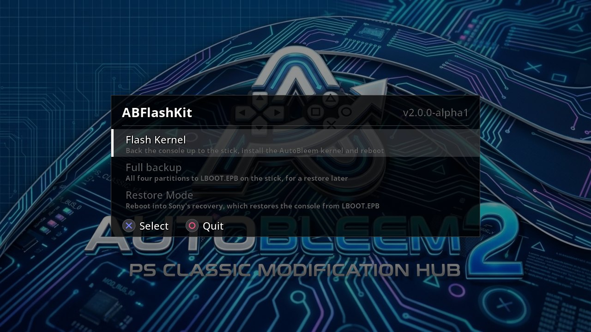

- **Flash Kernel**: macht ein Wiederherstellungs-Backup der Partitionen der Console auf dem Stick (`LBOOT.EPB`),
  wenn es noch nicht vorhanden ist, überprüft es und das Kernel-Image, schreibt den Kernel und AutoBleems
  Systemdateien und startet neu. *Alles fertig - wenn der Bildschirm schwarz wird, ziehen Sie das Stromkabel*:
  ziehen Sie das Stromkabel der Console und stecken Sie es wieder ein.
- **Vollständiges Backup**: alle vier Partitionen zu `LBOOT.EPB`, für eine Wiederherstellung später (das
  vorherige Backup wird nach einer Frage überschrieben).
- **Wiederherstellungsmodus**: überprüft, dass das Backup ein Stock ist, setzt das Wiederherstellungs-Flag
  und startet neu in Sonys Wiederherstellung, die die Console von `LBOOT.EPB` auf dem Stick wiederherstellt
  - der Weg zurück zur Stock-Firmware.

Eine Fortschrittsleiste unter jedem Schritt zeigt, wie weit die Aktion ist. Das Tool weigert sich, eine Console
zu flashen, die eine andere benutzerdefinierte Firmware ausführt (BleemSync, Project Eris): stellen Sie sie zuerst
auf Stock wieder her.

<!-- pagebreak -->

## 7. Wenn etwas schiefgeht

- **Protokolle**: AutoBleem behält seine Protokolle im Speicher, so dass der Stick nicht all die Zeit beschrieben
  wird - sie erreichen `System/Logs/` auf dem Stick, der Karte oder dem Datenordner nur, wenn etwas schiefgeht:
  ein Crash des Launchers, eines PS1-Spiels oder von RetroArch speichert sie zu `System/Logs/crash-<n>/`
  (die letzten drei werden behalten), und der Launcher sagt es einmal, wenn er kommt zurück. Um jedes Protokoll zu
  halten, schalten Sie ein *Optionen -> Diagnose -> Protokolle auf dem Stick behalten* (von dem nächsten Start an),
  oder erstellen Sie eine leere Datei `System/Logs/keep` auf einem PC. Auf einem Pi oder PC zeigt
  *Hardware-Informationen* wo die Protokolle sind und Square speichert sie zu `System/Logs/saved-<n>/`.
  Die Dateien: `autobleem.log` (der Launcher), `launch.log` und `pcsx.log` (ein PS1-Spielstart und die Ausgabe
  des Emulators), `retroarch.log`, und - immer auf dem Stick - `update.log` (ein Online-Update) und
  `updateroms.log` (UpdateRoms).
- **Ein Spiel ist nicht auf dem Regal**: überprüfen Sie das Ordner-Layout (ein Ordner pro Spiel, die
  Bild-Formate von Abschnitt 3.9). Der *Spiel-Manager* listet die Ordner auf, die der Scan ablehnte, nach den
  Spielen, markiert *Nicht addiert*, mit dem Grund; Square löscht einen solchen Ordner. *Spiele neu scannen*
  im Systemmenü führt den Scan erneut aus.
- **Keine Cover**: die Cover-Datenbanken wurden nicht installiert (führen Sie den Installer erneut mit ihnen aus),
  oder, für RetroArch-Spiele auf einer Console, UpdateRoms wurde nicht auf dem PC ausgeführt.
- **Ein Pad macht nichts oder hat seine Buttons durcheinander**: Der Gamepad-Wizard von PSC-Bios (eine Console)
  ordnet ihn zu; auf einem Pi oder PC listet die Hardware-Informations-Seite auf, was SDL sieht.
- **Die Console zeigt einen schwarzen Bildschirm nach einem Spiel**: AutoBleem baut sein Fenster von selbst auf
  (bis zu dreimal); wenn es schwarz bleibt, halten Sie die Power-Taste und schalten Sie die Console erneut ein.
- **Raspberry Pi**: `Alt+F2` gibt eine Anmelde-Eingabeaufforderung auf der zweiten Console; SSH ist ab dem ersten
  Start aktiviert. `sudo journalctl -u autobleem` zeigt den Service des Launchers; `sudo systemctl restart autobleem`
  startet ihn neu. Ein erster Boot, der nicht beendet konnte (kein Netzwerk) versucht es beim nächsten Boot.
- **Windows**: `Esc` verlässt den Launcher; der Datenordner ist der in der Einrichtung gewählte
  (`Documents\AutoBleem` standardmäßig), die Protokolle sind in seinem `System\Logs`.

AutoBleem ist freie Software (GNU GPL v3 oder später), ohne Gewährleistung. Support und News: der Discord-Server,
der auf dem Über-Bildschirm verlinkt ist, und https://autobleem.retromenele.pl/.
